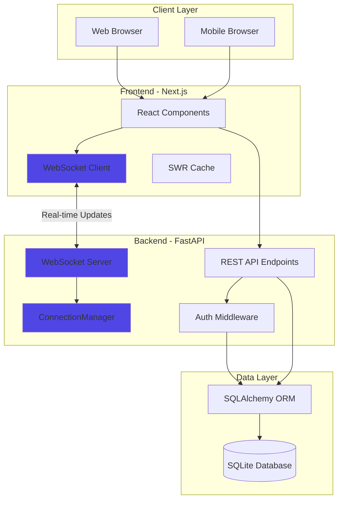
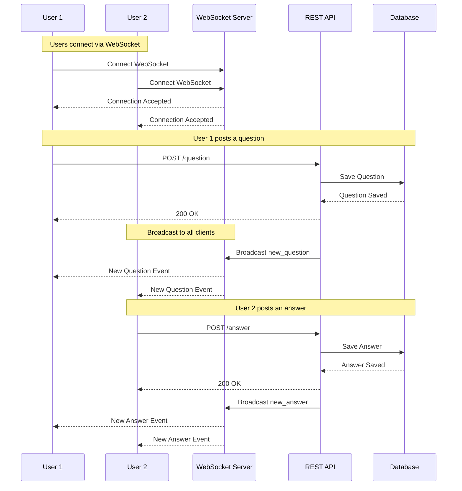
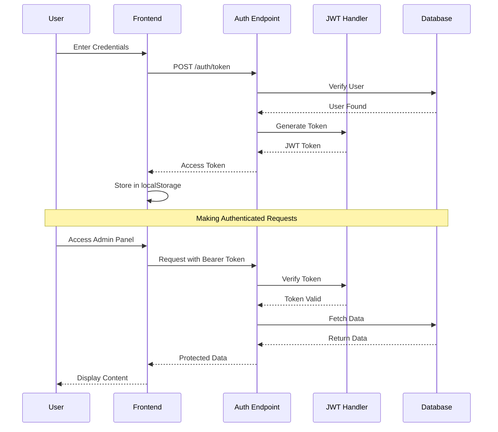
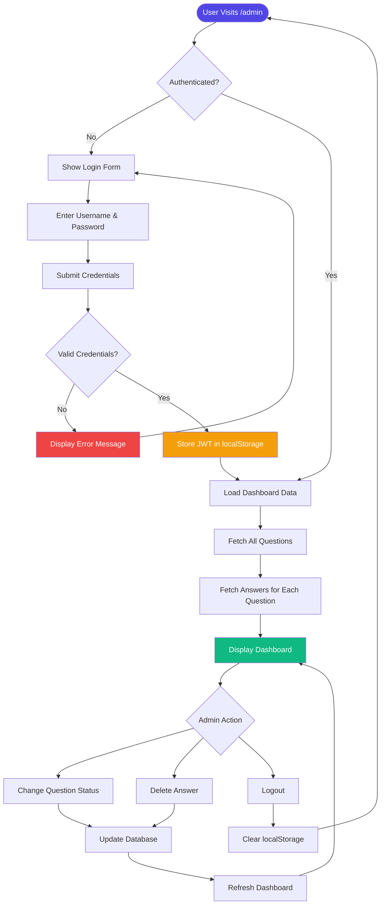
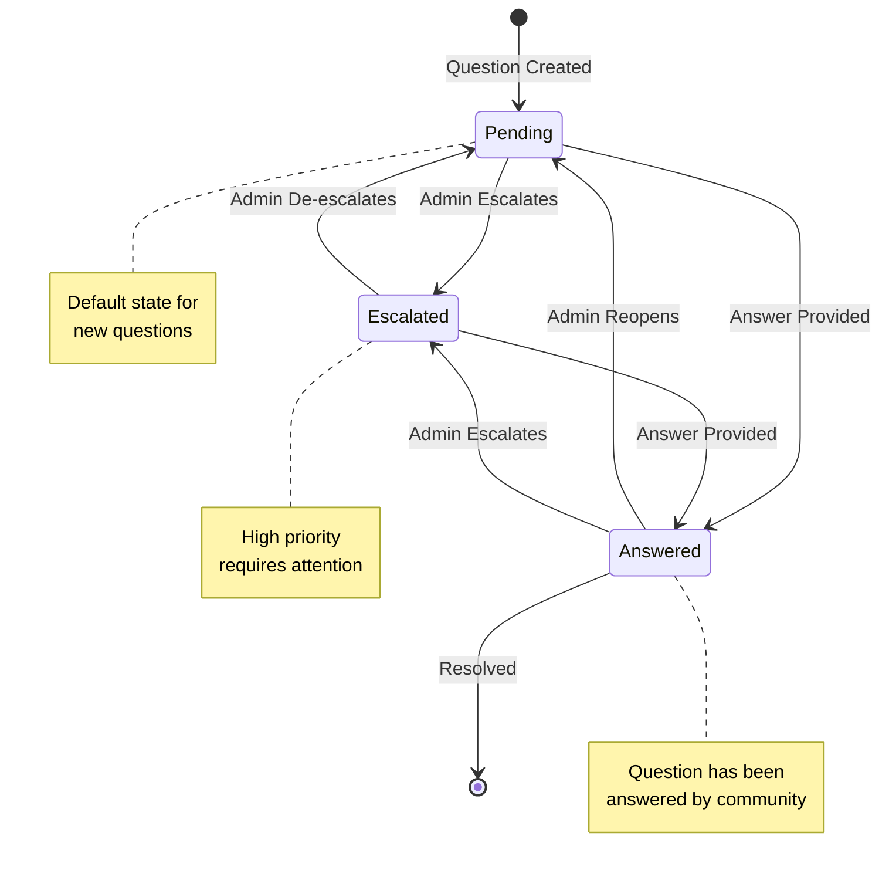
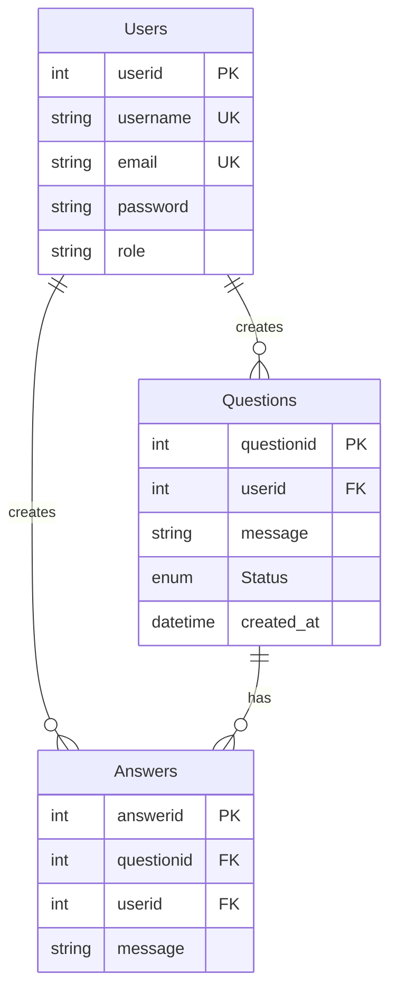

# Q&A Forum Application

A full-stack Q&A forum application built with FastAPI (backend) and Next.js (frontend), featuring real-time question and answer management with an admin panel.

## Features

- **User Features**
  - Ask questions
  - Answer questions
  - View all questions and answers
  - Real-time updates with WebSockets and SWR
  - Instant notifications for new questions

- **Admin Features**
  - Secure authentication with JWT
  - Manage question status (Pending, Escalated, Answered)
  - Delete answers
  - Dashboard with statistics
  - Priority sorting for escalated questions

### Installation & Setup

#### Using Docker (Recommended)

1. Clone the repository:
```bash
git clone https://github.com/Sha1kh4/Forum
cd Forum
```
2. Create .env file for backend url in frontend DIR

```bash 
echo "NEXT_PUBLIC_API_URL=http://localhost:8000" >> .env
```
or for powershell

```bash
"NEXT_PUBLIC_API_URL=http://localhost:8000" | Out-File -Append .env
```

3. Build and start the containers:
```bash
docker-compose up --build
```

4. Create a admin user by making curl request to backend 
```bash
curl -X 'POST' \
  'http://localhost:8000/auth/register' \
  -H 'accept: application/json' \
  -H 'Content-Type: application/json' \
  -d '{
  "username": "string",
  "password": "admin",
  "email": "string"
}'
```
5. Access the application:
   - Frontend: http://localhost:3000
   - Backend API: http://localhost:8000
   - API Documentation: http://localhost:8000/docs

## Local Development

**Backend Setup:**

```bash
cd backend
pip install uv
uv sync
source .venv/bin/activate  # On Windows: .venv\Scripts\activate
fastapi dev main.py
```

**Frontend Setup:**

```bash
cd frontend
npm install
npm run dev
```

Create a `.env.local` file in the frontend directory:
```
NEXT_PUBLIC_API_URL=http://localhost:8000
```
Create a admin user by making curl request to backend 
```bash
curl -X 'POST' \
  'http://localhost:8000/auth/register' \
  -H 'accept: application/json' \
  -H 'Content-Type: application/json' \
  -d '{
  "username": "string",
  "password": "admin",
  "email": "string"
}'
```
## Tech Stack

### Backend
- **FastAPI** - Modern Python web framework
- **WebSockets** - Real-time bi-directional communication
- **SQLAlchemy** - SQL toolkit and ORM
- **SQLite** - Database
- **JWT** - Authentication
- **Bcrypt** - Password hashing
- **Python Jose** - JWT implementation

### Frontend
- **Next.js 15** - React framework
- **React** - UI library
- **Tailwind CSS** - Styling
- **SWR** - Data fetching and caching
- **Radix UI** - Accessible component primitives

## Architecture Overview

### System Architecture



### WebSocket Real-time Flow



### Authentication Flow



### System Diagrams

### Admin Panel Workflow



### Question Status Lifecycle



## Database Schema



## Getting Started

### Prerequisites

- Docker and Docker Compose
- Node.js 20+ (for local development)
- Python 3.12+ (for local development)


## API Endpoints

### Authentication
- `POST /auth/register` - Register a new user
- `POST /auth/token` - Login and get access token
- `GET /auth/users/me` - Get current user info
- `DELETE /auth/answer` - Delete an answer (authenticated)
- `POST /auth/change-status` - Change question status (authenticated)

### Questions & Answers
- `GET /` - Health check
- `POST /question` - Create a new question
- `GET /questions` - Get all questions
- `POST /answer` - Submit an answer
- `GET /answers/{questionid}` - Get answers for a specific question

### WebSocket
- `WS /ws` - WebSocket connection for real-time question updates


## Database Schema

### Users Table
- `userid` - Primary key
- `username` - Unique username
- `email` - Unique email
- `password` - Hashed password
- `role` - User role (default: "admin")

### Questions Table
- `questionid` - Primary key
- `userid` - Foreign key to Users
- `message` - Question text
- `Status` - Enum (Pending, Escalated, Answered)
- `created_at` - Timestamp

### Answers Table
- `answerid` - Primary key
- `questionid` - Foreign key to Questions
- `userid` - Foreign key to Users
- `message` - Answer text

## Admin Panel

Access the admin panel at `/admin` to:
- View dashboard statistics
- Manage question statuses
- Delete inappropriate answers
- Monitor all questions and answers

Default admin credentials can be set up through the registration endpoint.

## Configuration

### Environment Variables

**Frontend:**
- `NEXT_PUBLIC_API_URL` - Backend API URL

**Backend:**
- `SECRET_KEY` - JWT secret key (currently hardcoded, should be moved to env)
- `ALGORITHM` - JWT algorithm (HS256)
- `ACCESS_TOKEN_EXPIRE_MINUTES` - Token expiration time

## Security Considerations

⚠️ **Important:** Before deploying to production:

1. Update CORS origins from `["*"]` to specific domains
2. Enable HTTPS
3. Implement rate limiting
4. Add input validation and sanitization
5. Set up proper logging and monitoring

## Development


### Code Style

- Backend: Follow PEP 8 guidelines
- Frontend: ESLint configuration included

## Docker Commands

```bash
# Build and start services
docker-compose up --build

# Start services in detached mode
docker-compose up -d

# Stop services
docker-compose down

# View logs
docker-compose logs -f

# Rebuild specific service
docker-compose up --build backend
```

## Troubleshooting

### Backend not connecting to database
- Ensure SQLite file has proper permissions
- Check if the database file is being created in the correct directory

### Frontend can't reach backend
- Verify `NEXT_PUBLIC_API_URL` is set correctly
- Check if backend container is running: `docker-compose ps`
- Ensure both services are on the same Docker network

### Authentication issues
- Clear localStorage in browser
- Check JWT token expiration
- Verify credentials are correct

## Contributing

1. Fork the repository
2. Create a feature branch (`git checkout -b feature/AmazingFeature`)
3. Commit your changes (`git commit -m 'Add some AmazingFeature'`)
4. Push to the branch (`git push origin feature/AmazingFeature`)
5. Open a Pull Request

## License

This project is licensed under the MIT License - see the LICENSE file for details.

## Acknowledgments

- FastAPI for the excellent Python web framework
- Next.js team for the React framework
- Tailwind CSS for the utility-first CSS framework
- Radix UI for accessible component primitives